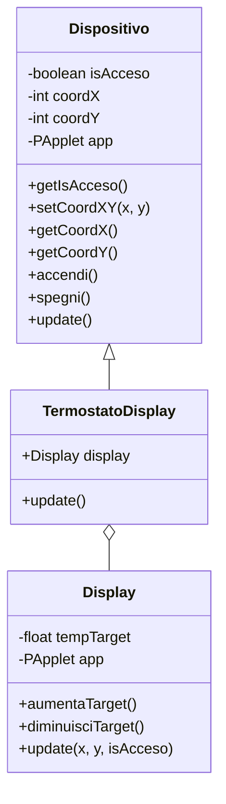

# 2024-4Cinf-verifica-preparazione
Esercizio di preparazione per la verifica

## Traccia - Sistema Domotico: Termostato Smart

Sviluppare un sistema che gestisce il controllo della temperatura di una stanza attraverso un termostato con display.

Il sistema è composto da:
1. Una classe base `Dispositivo` che gestisce:
   - Stato acceso/spento
   - Coordinate di visualizzazione
2. Una classe `Display` che mostra:
   - Temperatura corrente
   - Temperatura target
3. Una classe `TermostatoDisplay` che eredita da `Dispositivo` e integra un `Display`

Requisiti:
- Tasti:
  - 'a': accende/spegne il termostato
  - '+': aumenta temperatura target
  - '-': diminuisce temperatura target

## UML

